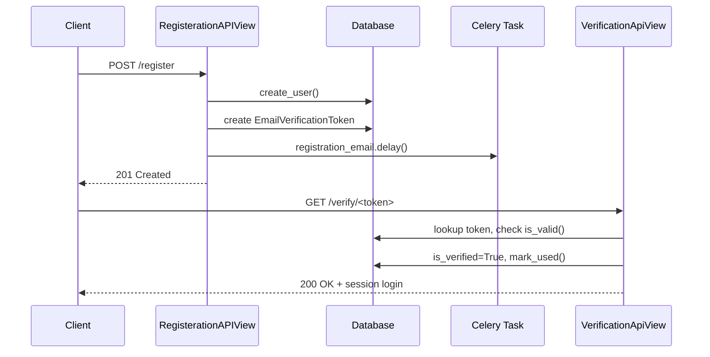
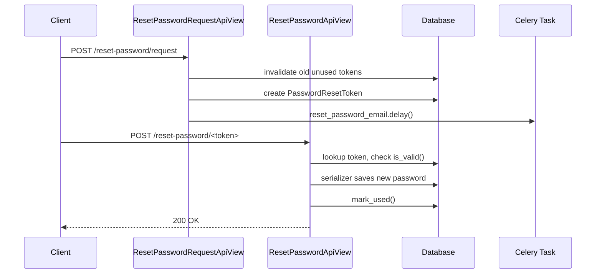

# Auth Module — Final Documentation (`apps/accounts`)

Complete reference for the authentication module: models, serializers,
views, async email tasks, periodic cleanup, and the Docker services that
support them.

---

## 1. Responsibility

The `accounts` app owns:

- Custom user model & registration
- Two authentication mechanisms (DRF Token + JWT)
- Email verification (single-use DB token, not JWT)
- Password reset (single-use DB token, not JWT)
- Password change (authenticated users)
- User profile (retrieve/update)
- Periodic cleanup of expired/used tokens (Celery Beat)

---

## 2. Directory Layout

```text
apps/accounts/
├── models/
│   ├── __init__.py          # re-exports User, Profile, EmailVerificationToken, PasswordResetToken
│   ├── users.py             # User, Profile
│   └── tokens.py            # EmailVerificationToken, PasswordResetToken
├── serializers.py
├── views.py
├── tasks.py                 # Celery tasks: email senders + cleanup
├── permissions.py           # IsNotAuthenticated
├── templates/
│   └── email/
│       ├── test-email.html      # verification email
│       └── reset-password.html  # password reset email
└── migrations/
```

---

## 3. Models (`models/tokens.py`)

Both token models share the same shape and are intentionally **not JWTs**
— they are single-use DB records, so a link can be invalidated the moment
it's consumed (something a stateless JWT can't do).

```python
class EmailVerificationToken(models.Model):
    user = models.ForeignKey(settings.AUTH_USER_MODEL, on_delete=models.CASCADE,
                              related_name="verification_tokens")
    token = models.UUIDField(default=uuid.uuid4, unique=True, editable=False)
    created_at = models.DateTimeField(auto_now_add=True)
    is_used = models.BooleanField(default=False)

    def is_valid(self) -> bool:
        expiry_time = self.created_at + timedelta(
            minutes=settings.VERIFICATION_TOKEN_EXPIRY_MINUTES
        )
        return not self.is_used and timezone.now() < expiry_time

    def mark_used(self):
        self.is_used = True
        self.save(update_fields=["is_used"])
```

`PasswordResetToken` is structurally identical, using
`settings.RESET_TOKEN_EXPIRY_MINUTES`.

**Design notes:**
- `settings.AUTH_USER_MODEL` (a string) is used instead of `get_user_model()`
  in the FK to avoid circular imports at app-loading time.
- Expiry is *computed* from `created_at`, never stored — a stored
  `is_expired` flag would be a second source of truth that can drift out
  of sync.
- Used tokens are **invalidated, not deleted** (`is_used=True`) — deletion
  happens later, in bulk, via the periodic cleanup task.

---

## 4. Serializers (`serializers.py`)

| Serializer | Purpose | Notable behavior |
|---|---|---|
| `RegisterationSerializer` | Register a new user | Validates password match + Django validators |
| `CustomTokenObtainPairSerializer` | JWT login | Rejects unverified users, adds `email`/`user_id` to response |
| `ChangePasswordSerializer` | Change password (authenticated) | Validation only — password is saved in the **view** |
| `ProfileSerializer` | Retrieve/update profile | — |
| `SendEmailSerializer` | Resolve email → user for resend/reset requests | — |
| `ResetPasswordSerializer` | Reset password via token flow | Validation **and** save both happen in `validate()` — deliberate deviation from convention, kept consistent across the reset flow |

---

## 5. Two Parallel Auth Mechanisms

| Mechanism | View | Use case |
|---|---|---|
| DRF Token Auth | `CustomObtainAuthToken` | Simple opaque token, no expiry |
| JWT (SimpleJWT) | `CustomTokenObtainPairView` | Access + refresh pair |

Both reject login with `400` if `user.is_verified` is `False`.

---

## 6. Views (`views.py`)

### Registration & Verification



`ResendVerificationApiView` invalidates any previous unused tokens for
the user (`filter(is_used=False).update(is_used=True)`) before issuing a
new one — so only the latest link ever works, no matter how many times
the user asks for a resend.

### Password Reset



### Exception handling convention

Both `VerificationApiView` and `ResetPasswordApiView` catch
`(EmailVerificationToken.DoesNotExist / PasswordResetToken.DoesNotExist,
ValidationError)` explicitly — `ValidationError` (from
`django.core.exceptions`) covers malformed UUIDs in the URL. No bare
`except Exception` is used in the token-lookup paths, so unrelated bugs
surface instead of being silently mapped to a generic 400.

---

## 7. Async Email Tasks (`tasks.py`)

| Task | Trigger | Template |
|---|---|---|
| `registration_email` | New registration / resend | `test-email` |
| `reset_password_email` | Password reset request | `reset-password` |
| `send_welcome_email` | After successful verification (optional) | `welcome` |
| `delete_expired_verification_tokens` | Celery Beat, periodic | — |
| `delete_expired_reset_password_tokens` | Celery Beat, periodic | — |

All email-sending tasks:
- Use `bind=True, max_retries=3, default_retry_delay=60` to retry on
  transient failures (e.g. SMTP temporarily unreachable).
- Pull `from_email`, `site_name`, `domain` from `settings`, never hardcoded.
- Log success/failure via the module logger.

Cleanup tasks delete in bulk with a single query rather than looping and
deleting row by row:

```python
EmailVerificationToken.objects.filter(
    models.Q(is_used=True) | models.Q(created_at__lt=expiry_threshold)
).delete()
```

### Required settings

```python
DEFAULT_FROM_EMAIL = "noreply@example.com"
SITE_NAME = "My Shop"
SITE_DOMAIN = "http://localhost:8000"
VERIFICATION_TOKEN_EXPIRY_MINUTES = 15
RESET_TOKEN_EXPIRY_MINUTES = 15
```

---

## 8. Email Templates

Both templates share the same context contract:

| Context key | Used for |
|---|---|
| `username` | Greeting |
| `site_name` | Branding |
| `domain` | Link base URL |
| `token` | Verification/reset link |
| `expiry_minutes` | Displayed validity window |

No template uses `uidb64` — the token alone resolves to a user via the
model's `user` FK, so the link is just `{{ domain }}/accounts/<action>/{{ token }}/`.

---

## 9. Celery Beat Setup

- `django_celery_beat` added to `INSTALLED_APPS`, migrated
  (`python manage.py migrate django_celery_beat`).
- `CELERY_BEAT_SCHEDULER = "django_celery_beat.schedulers:DatabaseScheduler"`
  — schedules are stored in the DB, not in code.
- **Scheduling is configured entirely through Django Admin** (Periodic
  Tasks / Interval Schedules / Crontab Schedules sections) — no
  `app.conf.beat_schedule` dict is defined in code. This means schedule
  changes (e.g. every 30 min → every hour) don't require a redeploy.
- Configured periodic tasks:
  - `apps.accounts.tasks.delete_expired_verification_tokens`
  - `apps.accounts.tasks.delete_expired_reset_password_tokens`
  Both attached to a shared Interval Schedule (every 30 minutes).
- If a task doesn't appear in the "Task (registered)" dropdown after
  adding it to `tasks.py`, restart `worker`/`beat` so Celery re-discovers
  it, or use the "Task (custom)" field with the full dotted path as a
  workaround.

---

## 10. Docker Compose Services

| Service | Role |
|---|---|
| `db` | PostgreSQL |
| `redis` | Celery broker/result backend |
| `backend` | Django app server |
| `smtp4dev` | Dev SMTP catcher — view sent emails at `http://localhost:5000` |
| `worker` | Celery worker — executes tasks |
| `beat` | Celery Beat — schedules periodic tasks, requires DB access (`DatabaseScheduler`) |

Both `worker` and `beat` set `PYTHONPATH: /app/apps:/app` to resolve the
`apps.*` import path inside the container.

`backend`'s command runs migrations before starting the server, so
`django_celery_beat`'s tables (and any new app migrations) are always
applied on startup:

```yaml
command: sh -c "python manage.py migrate && python manage.py runserver 0.0.0.0:8000"
```

---

