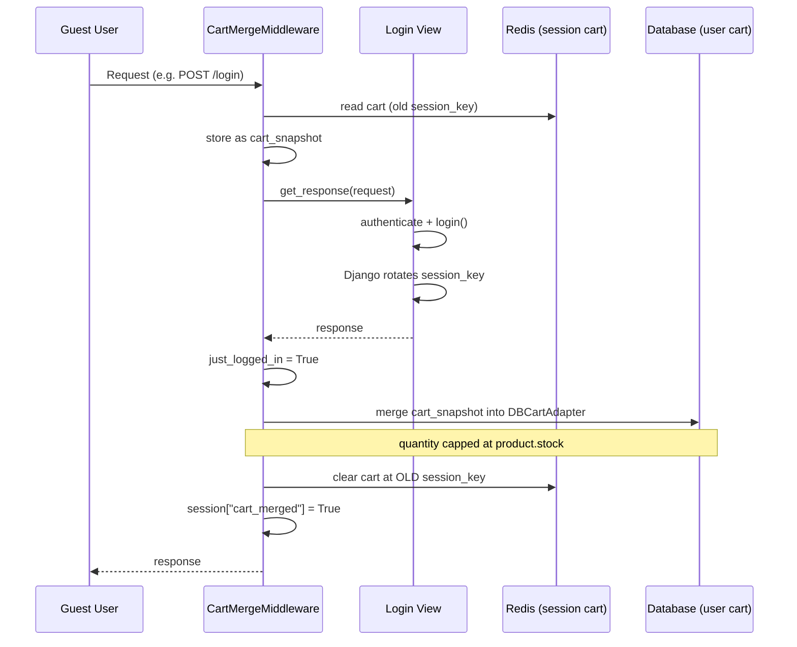

# Cart App Architecture

## 1. Purpose

This document explains how the shopping cart is implemented for both
guest (unauthenticated) and logged-in users, why two separate storage
backends exist, and how a guest's cart is merged into their account
cart at login — including the non-obvious session-key issue that
drove the middleware's design.

---

## 2. Overview

The cart system supports two kinds of users with two different storage
backends behind a **shared interface**:

| User type | Class | Storage |
|---|---|---|
| Guest (not logged in) | `Cart` | Redis, via Django's cache framework |
| Logged-in | `DBCartAdapter` | PostgreSQL (`Cart` / `CartItem` models) |

Both classes expose the same methods — `add()`, `remove()`, `update()`,
`clear()`, `get_quantity()`, `get_total_price()`, `__len__()`,
`__iter__()` — so any code that uses a cart (views, templates, the
merge middleware) doesn't need to know or care which backend is behind
it. This is a deliberate **duck-typing** design.

---

## 3. Technical Decisions

### D1 — Two interchangeable cart classes instead of one class with branching logic

| | |
|---|---|
| **Problem** | Guest carts and logged-in carts need fundamentally different storage (no user account to attach a DB row to for guests). |
| **Options** | (a) One `Cart` class with `if self.user: ... else: ...` branches everywhere; (b) two classes sharing an identical public interface. |
| **Chosen** | (b) — `Cart` (Redis) and `DBCartAdapter` (database), both exposing the same method signatures. |
| **Reason** | Calling code (views, the merge middleware) can treat either object identically — `for item in cart`, `len(cart)`, `cart.add(...)` — without branching on user type. |
| **Result** | Adding a third backend later (if ever needed) would not require touching any existing call site, only adding a new class with the same interface. |

### D2 — Price is read live from the product, never stored in the cart

| | |
|---|---|
| **Observation** | Both `Cart` (Redis dict) and `CartItem` (DB model) only store `quantity`. Price is always fetched from `product.final_price` at read time (`__iter__`). |
| **Reason** | Keeps a single source of truth for pricing — the product itself — rather than a cached price that could drift from the current price. |
| **Consequence** | If a product's price changes while it's sitting in someone's cart, the cart will show the *new* price the next time it's rendered, not the price at the moment it was added. This is a deliberate trade-off, not a bug — see §6. |

### D3 — Snapshot the guest cart *before* calling `get_response()`, not after

| | |
|---|---|
| **Problem** | Django rotates the session key on login (a security measure against session-fixation attacks). Since `Cart`'s Redis key is built from `session.session_key` (`cart_{session_key}`), constructing a fresh `Cart(request.session)` *after* login would compute a **different** Redis key — the guest cart data would appear to have vanished, even though it's still sitting under the old key. |
| **Chosen** | `CartMergeMiddleware` reads `session_cart = Cart(request.session)` and copies its contents into `cart_snapshot` **before** calling `self.get_response(request)` — i.e. before login (and the session-key rotation) can happen. |
| **Reason** | This captures the guest cart's contents while the old session key is still valid, so the data survives the key rotation that happens during the login view. |
| **Result** | The merge always has access to the guest cart's actual contents, regardless of whether login rotated the session key during the request. |

### D4 — Merge quantity is capped at available stock, not simply summed

| | |
|---|---|
| **Problem** | Blindly adding guest-cart quantity to whatever is already in the DB cart could push the cart quantity above the product's available stock. |
| **Chosen** | `allowed_to_add = min(session_quantity, product.stock - current_db_quantity)` — only as much is added as stock allows. |
| **Result** | The DB cart quantity for a product never exceeds `product.stock` as a direct result of a merge. If the guest cart requested more than available, the user is warned via `messages.warning(...)` and only the available amount is added. |

---

## 4. Models (`cart/models.py`)

```text
Cart (1) ── (N) CartItem ── (1) Product
```

| Model | Field | Notes |
|---|---|---|
| `Cart` | `user` (`OneToOneField`) | One cart per user — enforced at the DB level |
| `Cart` | `total_price` (property) | Computed by summing `CartItem.total_price` — not stored |
| `CartItem` | `cart`, `product` | Unique together (`UniqueConstraint`) — a product can appear only once per cart |
| `CartItem` | `quantity` (`PositiveIntegerField`) | |
| `CartItem` | `price` / `total_price` (properties) | Both computed live from `product.final_price` — see D2 |

The `UniqueConstraint(fields=["cart", "product"])` is what makes
`DBCartAdapter.add()` safe to call repeatedly for the same product: the
`get_or_create()` call either creates one row or updates the existing
one — the constraint guarantees there's never more than one `CartItem`
row per (cart, product) pair to update.

---

## 5. The Two Cart Classes (`cart/cart.py`)

### `Cart` (guest, Redis-backed)

Internal representation in Redis is a plain dict, keyed by product ID
as a string:

```python
{
    "1": {"quantity": 4},
    "2": {"quantity": 7},
}
```

- Ensures a session exists (`self.session.create()`) if the visitor has
  no session yet, so a Redis key can always be built.
- The whole dict is read and rewritten on every mutation (`_save()`
  calls `cache.set(...)` with the entire cart) — see §6 for the
  concurrency implication of this.
- Stored with a **7-day TTL** (`timeout=60*60*24*7`); an abandoned
  guest cart disappears on its own after a week.
- `__iter__` fetches the actual `Product` rows in one query
  (`Product.objects.filter(id__in=product_ids)`) to build display data
  (name, live price, computed total) — the Redis dict itself only ever
  holds quantities.

### `DBCartAdapter` (logged-in, database-backed)

Wraps the `Cart`/`CartItem` models behind the same interface as the
Redis-backed `Cart`:

- `__init__` calls `DBCart.objects.get_or_create(user=user)`, so a cart
  row always exists for an authenticated user by the time any method
  runs.
- `add()` uses `CartItem.objects.get_or_create(...)`, relying on the
  `unique_cart_product` constraint to safely increment an existing row
  rather than create a duplicate.
- `update()`/`remove()` operate directly via `.filter(...).update()` /
  `.delete()` — no need to fetch the object first.
- `__iter__` uses `select_related("product")` to avoid an N+1 query
  when building item data for every row.

---

## 6. Merge Flow (`cart/middleware.py` — `CartMergeMiddleware`)



### Step-by-step

1. **Before** the view runs, the middleware reads the guest cart via
   `Cart(request.session)` and copies it into `cart_snapshot` (see
   Decision D3 — this must happen before the session key can rotate).
2. `get_response(request)` runs the actual view — this is where login
   happens, if it's a login request.
3. After the view returns, the middleware checks
   `just_logged_in = not was_authenticated and request.user.is_authenticated`.
4. If the user is now authenticated **and** the session hasn't already
   been merged (`not request.session.get("cart_merged")`):
   - If they just logged in this request, merge `cart_snapshot` (the
     pre-login data).
   - Otherwise (already logged in, merge just hadn't run yet for this
     session — a safety net for sessions predating this middleware or
     with a cleared flag), re-read the *current* session cart and merge
     that instead.
   - After a successful just-logged-in merge, clear the old guest cart
     (`session_cart.clear()`) so it doesn't linger in Redis.
   - Set `request.session["cart_merged"] = True` so this doesn't run
     again for the same session.

### `_merge()` logic, per product in the snapshot

```text
current_db_quantity = quantity already in the DB cart for this product
session_quantity    = quantity from the guest cart
allowed_to_add       = min(session_quantity, stock - current_db_quantity)

if allowed_to_add > 0:
    add allowed_to_add to the DB cart

if (current_db_quantity + session_quantity) > stock:
    warn the user that quantity was capped
```

A product that no longer exists (deleted after being added to the
guest cart) is silently skipped (`if not product: continue`).

---

## 7. Business Rules

- A logged-in user's cart quantity for any product never exceeds that
  product's current stock as a result of a merge.
- The merge runs at most once per session (tracked via
  `session["cart_merged"]`), not once per user — a user logging in from
  a second browser/session will trigger a second merge for that
  session's guest cart contents.
- Cart prices are always the product's *current* price, never a price
  frozen at the time an item was added.
- A guest cart with no session activity for 7 days is deleted
  automatically (Redis TTL).

---

## 8. Concurrency & Locking (implemented fixes)

Two race conditions identified during development (§11, Problems 1–2)
were fixed using the same underlying primitive: `cache.add()`, Django's
atomic "set the key only if it doesn't already exist" operation. This
works across any cache backend (Redis, Memcached, even LocMemCache in
tests) rather than relying on Redis-specific commands.

### Fix 1 — `Cart`'s read-modify-write race

`Cart.add()` / `update()` / `remove()` / `clear()` now run inside a
`_locked()` context manager:

1. Try to `cache.add()` a per-cart lock key; retry briefly (up to 2s)
   if another request holds it.
2. Once acquired, **re-read** the cart from cache (another request may
   have changed it while this one was waiting).
3. Apply the change and save.
4. Release the lock (`cache.delete(lock_key)`).

If the lock can't be acquired in time, a `CartLockTimeout` is raised —
callers (views) are expected to catch this and return a "please try
again" response rather than silently proceeding without the lock.

### Fix 2 — Merge double-execution race

`CartMergeMiddleware` no longer relies solely on
`request.session["cart_merged"]` to decide whether to merge — a session
flag isn't reliable across concurrent requests, since each request
loads its own in-memory copy of the session and only writes it back at
the end. Instead, the middleware **claims** the merge atomically:

```python
claimed = cache.add(claim_key, "1", timeout=MERGE_CLAIM_TIMEOUT)
if claimed:
    self._merge(request, data_to_merge)
```

`claim_key` is built from the *pre-login* session key for a
just-logged-in merge (consistent with Decision D3), so it uniquely
identifies "the merge of this specific guest cart." Only the first of
any concurrent requests can successfully claim it; the rest skip the
merge, trusting the winner to have handled it.

---

## 9. Views (`cart/views.py`)

All cart mutation views follow the same shape: validate input →
delegate to `get_cart(request)` (which returns either a `Cart` or a
`DBCartAdapter` — the caller doesn't need to know which) → return a
JSON response consumed by `cart.js`.

| View | Method | URL | Notes |
|---|---|---|---|
| `AddToCartView` | POST | `/cart/add/<product_id>/` | Rejects quantity < 1 and quantity that would exceed `product.stock` |
| `CartView` | GET | `/cart/` | Renders `cart-summary.html`; not an API endpoint |
| `CartUpdateView` | POST | `/cart/update/<product_id>/` | Same stock/quantity validation as add |
| `CartRemoveView` | POST | `/cart/remove/<product_id>/` | |
| `ClearCartView` | POST | `/cart/clear-cart/` | |

**Known gap:** `CartUpdateView` and `CartRemoveView` return
`success: True` unconditionally, even if the product wasn't actually in
the cart to begin with (`cart.update()`/`cart.remove()` silently no-op
in that case). This should eventually be tightened so the JSON response
reflects whether anything actually changed.

---

## 10. Frontend Integration (`cart.js` + `base.html`)

`cart.js` drives the cart page's interactivity (`+`/`-` buttons, remove,
clear) via `fetch()` calls to the views in §9, then updates the DOM
in place with the JSON response (quantity, item total, cart total,
header badge count) — no full page reload.

It depends on two helper functions that must be defined **before**
`cart.js` runs:

- `getCookie(name)` — reads the CSRF token from cookies for the
  `X-CSRFToken` header.
- `showToast(message, type)` — a thin wrapper around the `Toastify`
  library used to surface success/error messages.

Both are defined in `base.html`'s `<head>`, not at the bottom of
`<body>` with the other scripts — see §11, Problem 3, for why that
placement matters.

---

## 11. Problems and Solutions

### Problem 1 — Redis cart read-modify-write race

**Investigation:** Identified by code review, not yet observed in
production — `Cart.add()` read the whole cart dict, mutated it in
Python, and wrote it back, with no protection between the read and the
write.

**Cause:** Two near-simultaneous requests for the same guest session
(double-click, two open tabs) could both read the same stale state; the
second write would silently overwrite the first's change instead of
combining with it.

**Severity:** Medium — would not error visibly, just silently drop a
quantity change under specific timing.

**Solution:** Added `Cart._locked()`, a `cache.add()`-based mutex
around every mutation (§8, Fix 1).

**Result:** Concurrent mutations on the same guest cart are now
serialized; the second one always operates on the first one's result.

---

### Problem 2 — Merge could run twice for the same login

**Investigation:** Identified by code review of `CartMergeMiddleware` —
the `cart_merged` session flag is only set *after* `_merge()` finishes.

**Cause:** Two overlapping requests right after login (e.g. a
double-clicked login button) each load their own copy of the session
before either writes back the `cart_merged` flag, so both could pass
the "not merged yet" check and both call `_merge()`, doubling
quantities.

**Severity:** Medium — a plausible edge case around login, not a
constant occurrence, but produces incorrect cart contents when it hits.

**Solution:** Replaced the session-flag check with an atomic
`cache.add()`-based claim keyed on the pre-login session key (§8, Fix
2).

**Result:** Only one of any concurrent requests can successfully claim
and perform the merge for a given guest cart.

---

### Problem 3 — `ReferenceError: getCookie is not defined`

**Investigation:** Browser console showed the error firing from inside
`changeProductQuantity` (`cart.js:41`), triggered by clicking the `+`
button. No network request was ever sent — the error occurred before
`fetch()` was reached, and no toast appeared because `showToast` (called
in the `.catch()` block) never ran either, since the surrounding
function had already thrown.

**Cause:** `getCookie` was never defined anywhere in the loaded scripts.
Additionally, `cart.js` is embedded inline inside ``
in `cart-summary.html`, which renders and executes *before* the
scripts at the bottom of `<body>` in `base.html` (jQuery, `theme.min.js`,
`custom.js`) — so even a `getCookie` defined down there would have been
too late.

**Severity:** High from the user's perspective (every quantity
change/remove/clear silently did nothing) but simple to fix — this is
exactly the kind of failure described in §12 as looking like a backend
bug but actually being a missing frontend dependency.

**Solution:** Defined `getCookie` (and, proactively, `showToast`, which
would have failed the same way immediately after) in a `<script>` block
in `base.html`'s `<head>`, before any other script — including inline
scripts embedded in `` — can run. Also moved the
`Toastify` library `<script>` tag from the bottom of `<body>` to
`<head>`, since `showToast` depends on it and needed it to be available
just as early.

**Result:** Quantity buttons, remove, and clear-cart all work as
expected; errors and successes now surface via toast notifications
instead of failing silently.

---

## 12. Known Limitations

- **`DBCartAdapter` still has a minor race window.** `add()`'s
  `item.quantity += quantity; item.save(...)` is not atomic at the
  database level — two simultaneous "add to cart" requests for the same
  logged-in user and product could each read the same starting
  quantity and one increment could be lost. Not yet fixed; lower
  priority than the Redis/merge races since it requires two concurrent
  requests from the *same authenticated user* for the *same product*,
  a narrower window than the guest-session and login-time races.
- Cart items don't store the price at the time of adding (Decision D2)
  — intentional, but means there's no record of "what the customer
  thought they'd pay" if the price changes before checkout.
- `CartUpdateView`/`CartRemoveView` report `success: True` even when
  nothing actually changed (§9).

---

## 13. Future Improvements

- Wrap `DBCartAdapter.add()`'s increment in `F()` expressions
  (`item.quantity = F("quantity") + quantity`) or a `select_for_update()`
  block to close the remaining race noted in §12.
- Have `cart.js` catch a `CartLockTimeout`-triggered error response
  (e.g. a 503) and show a specific "please try again" toast rather than
  the generic "خطایی رخ داد" message.
- Consider snapshotting the price at add-time if there's ever a
  business need to honor "the price the customer saw" rather than the
  live price.
- Make `CartUpdateView`/`CartRemoveView` return whether a change
  actually occurred, and have `cart.js` handle a no-op response
  distinctly from a successful change.